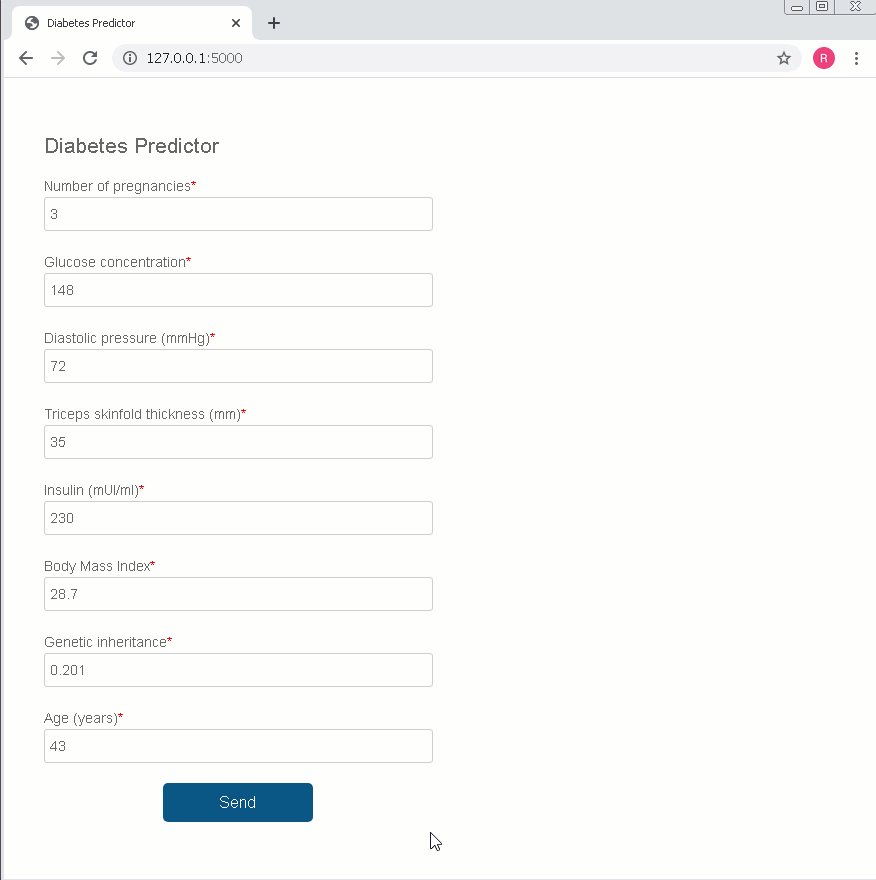

# Diabetes Predictor

Simple Flask application as a final challenge in the IGTI Python Developer Bootcamp. The goal was to determine among three machine learning algorithms the one with the best accuracy to predict whether a person has diabetes and show the result in a GUI.

### Tech:

  - Python
  - Flask
  - Scikit-learn: Algorithms: KNeighbors, Tree Decision and Multi-layer Perceptron (MLP) 
  - Google Colab (for the initial part where I chose among the three models)

### Files:
  - Machine Learning Model (Multi-layer Perceptron): prediction_model.sav  
  - Google Colab code: choosing_model.ipynb
  - Entry data: diabetes_data.csv

### Setup:
  - Install Flask
  ```  
python -m pip install flask
```
  - Run the project:
  ```
  python app.py
```

<br/><br/>

